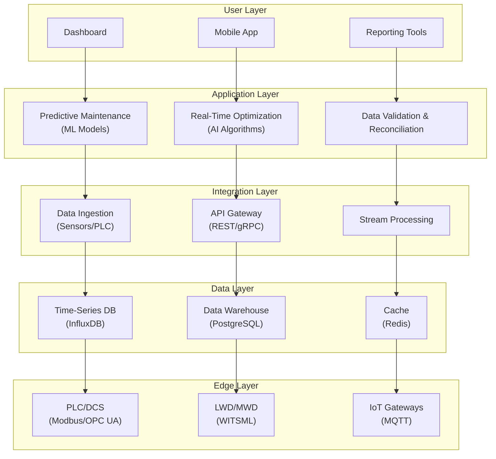
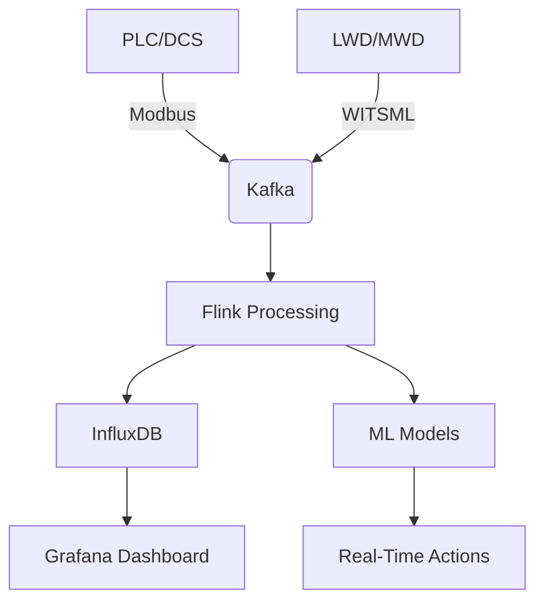

# **Smart Drilling Automation Software Requirements Document (SRS)**  
**Version: 1.0**  
**Date: 2024/06/29**  
**Prepared by: AI and Drilling Automation Development Team**  

---

## **1. Introduction**  
This document specifies the requirements for the **Digital Twin software for a 1000 HP onshore drilling rig**. The system includes **predictive maintenance, real-time optimization, data validation, data reconciliation, and LWD/MWD data collection**.

### **1.1. Purpose**  
- Develop an intelligent system for **monitoring, predicting, and optimizing drilling operations**.  
- **Reduce rig downtime** using predictive maintenance.  
- **Improve drilling efficiency** through real-time decision-making.  
- **Integrate sensor, PLC, DCS, SCADA, LWD, and MWD data**.

### **1.2. Scope**  
- **Real-time monitoring** of drilling parameters.  
- **Failure prediction** using machine learning.  
- **Optimization of drilling parameters** (WOB, RPM, mud flow, etc.).  
- **Integration with control systems (PLC/DCS/SCADA)**.  
- **Support for LWD/MWD data**.

---

## **2. General Requirements**

### **2.1. Functional Requirements**

| **ID** | **Requirement** | **Description** |
|--------|-----------------|-----------------|
| FR-001 | **Real-time sensor data monitoring** | Data collection with < 1 sec delay |
| FR-002 | **Equipment failure prediction** | Use ML algorithms for failure prediction |
| FR-003 | **Drilling parameter optimization** | Auto-adjust WOB, RPM, pump pressure |
| FR-004 | **Data validation** | Noise and invalid data detection |
| FR-005 | **PLC/DCS/SCADA integration** | Modbus TCP/IP, OPC UA protocol support |
| FR-006 | **LWD/MWD support** | Receive gamma, resistivity, vibration data |
| FR-007 | **Management dashboard** | Graphical display with real-time alerts |
| FR-008 | **Historical data storage and analysis** | Use time-series DBs like InfluxDB |

### **2.2. Non-Functional Requirements**

| **ID** | **Requirement** | **Description** |
|--------|-----------------|-----------------|
| NFR-001 | **Performance** | Data processing with < 500ms latency |
| NFR-002 | **Reliability** | Uptime ≥ 99.9% |
| NFR-003 | **Security** | User authentication, data encryption |
| NFR-004 | **Scalability** | Support adding new sensors without code changes |

---

## **3. Required Sensors**

### **3.1. Rig Core Sensors**

| **Sensor Type** | **Measured Parameter** | **Communication Protocol** |
|-----------------|------------------------|-----------------------------|
| Pressure Sensor | Mud pressure | 4-20mA / Modbus RTU |
| Flow Meter | Mud flow rate | Modbus TCP |
| Load Cell | Weight on bit (WOB) | CAN Bus |
| Encoder | Rotational speed (RPM) | RS-485 |
| Accelerometer | Rig vibrations | SPI/I2C |
| Thermometer | Engine and hydraulic temp | Modbus RTU |
| Gas Sensor | Hazardous gases detection | HART Protocol |

### **3.2. LWD/MWD Sensors**

| **Sensor Type** | **Measured Parameter** | **Communication Protocol** |
|-----------------|------------------------|-----------------------------|
| Gamma | Gamma radiation | WITS/WITSML |
| Resistivity | Formation resistivity | WITSML |
| Vibration | Bit vibration | Mud Pulse Telemetry |
| Downhole Pressure | Downhole pressure | EM Telemetry |

---

## **4. Required Algorithms**

### **4.1. Machine Learning Algorithms**

- **Predictive Maintenance:**  
  - Random Forest / LSTM for failure pattern detection.  
- **Drilling Optimization:**  
  - Reinforcement Learning for parameter adjustment.  
- **Anomaly Detection:**  
  - Isolation Forest / Autoencoders.

### **4.2. Real-Time Data Processing**

- **Kalman Filter** for noise reduction.  
- **Fast Fourier Transform (FFT)** for vibration analysis.

---

## **5. Control Systems Integration (PLC/DCS/SCADA)**

### **5.1. Communication Methods**

| **System** | **Protocol** | **Connection Method** |
|------------|--------------|-----------------------|
| PLC | Modbus TCP/IP | Ethernet |
| DCS | OPC UA | Secure WebSocket |
| SCADA | MQTT | Broker-Based |
| LWD/MWD | WITSML | REST API |

### **5.2. Example PLC Integration Code (Python)**

```python
import pyModbusTCP

client = pyModbusTCP.ModbusClient(host="PLC_IP", port=502)
wob = client.read_holding_registers(0, 1)  # Read WOB
client.write_single_register(1, 2500)      # Set RPM
```
## 6. Summary

This document comprehensively covers the requirements for developing a **drilling digital twin**, including sensors, algorithms, PLC/DCS connectivity, and LWD/MWD data analysis.

**Next Steps:**

- Design the system architecture
- Develop a prototype
- Perform integration testing with the actual rig

---

# **Digital Twin System Architecture for Drilling Automation**  
**Version: 1.0**  
**Date: 2024/06/29**  

---

## 1. Overall Architecture  
The system is designed as a **layered architecture with microservices** to fulfill real-time monitoring, failure prediction, optimization, and integration with existing hardware.

### 1.1. High-Level Architecture Diagram




---

## 2. Layer Details

### 2.1. Edge Layer (Hardware and Communication)  
**Role:** Collect data from sensors and industrial control systems.  
**Components:**  

- **PLC/DCS:**  
  - Protocols: Modbus TCP/IP, OPC UA  
  - Data read: WOB, RPM, pump pressure, temperature  

- **LWD/MWD:**  
  - Protocol: WITSML (REST API or WebSocket)  
  - Data: Gamma, formation resistivity, bit vibration  

- **IoT Gateway:**  
  - Software: Node-RED or Kafka Connect  
  - Role: Protocol translation to MQTT/HTTP  

### 2.2. Data Layer  
**Role:** Store and manage real-time and historical data.  

| Component        | Technology      | Purpose                             |
|------------------|-----------------|-----------------------------------|
| Time-Series DB    | InfluxDB        | Store high-frequency sensor data  |
| Data Warehouse   | PostgreSQL      | Store analytics data and metadata |
| Cache            | Redis           | Reduce latency on frequent access |

### 2.3. Integration Layer  
**Role:** Stream data processing and cross-layer communication.  

| Component       | Technology           | Purpose                              |
|-----------------|----------------------|------------------------------------|
| Data Ingestion  | Apache Kafka / MQTT Broker | Collect sensor data             |
| Stream Processing | Apache Flink / Spark Streaming | Real-time processing        |
| API Gateway    | Kong / Nginx          | Manage internal/external APIs       |

### 2.4. Application Layer  
**Role:** Run AI models and business logic.  

| Service              | Technology                  | Description                          |
|----------------------|-----------------------------|------------------------------------|
| Predictive Maintenance | Python (TensorFlow/PyTorch) | LSTM models for failure prediction |
| Real-Time Optimization | Reinforcement Learning      | Auto-tune drilling parameters      |
| Data Validation       | Rule Engine (Drools)         | Detect invalid/noisy data           |

### 2.5. User Layer  
**Role:** Present information and interact with operators.  

| Component     | Technology             | Purpose                          |
|---------------|-----------------------|--------------------------------|
| Dashboard     | Grafana + React.js    | Real-time monitoring UI         |
| Mobile App   | Flutter               | Instant alerts and reporting    |
| Reporting    | Power BI              | Historical data analysis        |

---

## 3. Data Flow  
1. **Data Collection:**  
   Sensors → PLC → MQTT/Kafka → Stream Processing.  

2. **Real-Time Processing:**  
   Noise filtering → Anomaly detection → Store in InfluxDB.  

3. **Analysis & Decision Making:**  
   ML models → Failure prediction → Commands sent to PLC.  

4. **Display & Alerts:**  
   Grafana dashboard → Notifications via Telegram/Email.  

---

## 4. Security Considerations  
- **Data Encryption:** Use TLS/SSL for all communications.  
- **Authentication:** OAuth 2.0 for API access control.  
- **Hardware Security:** Industrial firewall between PLC and IT network.  

---

## 5. Recommended Development Tools  

| Goal                  | Technology / Tools        |
|-----------------------|--------------------------|
| Backend Development   | Python (FastAPI)          |
| Stream Processing     | Apache Flink              |
| Container Management  | Docker + Kubernetes       |
| Monitoring            | Prometheus + Grafana      |
| CI/CD                 | GitLab CI                 |

---

## 6. Summary  
This architecture is designed to be scalable, real-time, and secure for the drilling digital twin system.  

**Next Steps:**  
- Prototype implementation using Docker and Kafka.  
- Integration testing with simulated PLC.  

---

# **Prototype Implementation of Drilling Digital Twin System**  
**Next Step: Initial Implementation and Integration Testing**  

---

## 1. Setting Up the Development Environment

### 1.1. Hardware/Software Requirements  
- **Server:**  
  - Minimum specs: **4 CPU cores, 16GB RAM, 100GB SSD** (or cloud like AWS/GCP).  
  - OS: **Ubuntu 22.04 LTS**.  
- **Required Software:**  
  - Docker + Docker-Compose  
  - Python 3.10+  
  - Apache Kafka  
  - InfluxDB 2.0  

### 1.2. Installing Tools  

```bash
# Install Docker and Docker-Compose
sudo apt update && sudo apt install docker.io docker-compose -y
sudo systemctl enable docker

# Install Python and necessary libraries
sudo apt install python3-pip
pip3 install fastapi kafka-python influxdb-client pymodbus torch scikit-learn

# Clone and run Kafka + InfluxDB with Docker
git clone https://github.com/digital-twin-oil/docker-compose.git
cd docker-compose
docker-compose up -d
```

## 2. Implementing Key Services

### 2.1. Data Ingestion (Collecting Data from Sensors and PLC)

```python
from pyModbusTCP.client import ModbusClient
import time

def read_plc_data():
    plc = ModbusClient(host="192.168.1.100", port=502, auto_open=True)
    while True:
        wob = plc.read_holding_registers(0, 1)[0]
        rpm = plc.read_holding_registers(1, 1)[0]
        print(f"WOB: {wob} kg, RPM: {rpm}")
        time.sleep(1)

if __name__ == "__main__":
    read_plc_data()
```

### 2.2. Stream Processing with Apache Kafka

**Producer:**

```python
from kafka import KafkaProducer
import json

producer = KafkaProducer(
    bootstrap_servers='localhost:9092',
    value_serializer=lambda v: json.dumps(v).encode('utf-8')
)

def send_sensor_data():
    data = {"sensor_id": "pressure_1", "value": 250, "unit": "psi"}
    producer.send('sensor-data', data)

send_sensor_data()
```

**Consumer:**

```python
from kafka import KafkaConsumer
import json

consumer = KafkaConsumer('sensor-data', bootstrap_servers='localhost:9092')

for msg in consumer:
    data = json.loads(msg.value)
    print(f"Received: {data}")
```

---

## 3. Setting Up Database and Data Storage

### 3.1. Configuring InfluxDB

```python
from influxdb_client import InfluxDBClient
from datetime import datetime

client = InfluxDBClient(url="http://localhost:8086", token="my-token", org="my-org")
write_api = client.write_api()

data = {
    "measurement": "drilling",
    "tags": {"sensor": "wob"},
    "fields": {"value": 1200},
    "time": datetime.utcnow()
}

write_api.write(bucket="drilling-data", record=data)
```

---

## 4. Implementing AI Models

### 4.1. Failure Prediction Model (LSTM)

```python
import torch
import torch.nn as nn

class LSTMModel(nn.Module):
    def __init__(self, input_size=5, hidden_size=64):
        super().__init__()
        self.lstm = nn.LSTM(input_size, hidden_size, batch_first=True)
        self.fc = nn.Linear(hidden_size, 1)

    def forward(self, x):
        out, _ = self.lstm(x)
        return torch.sigmoid(self.fc(out[:, -1]))

model = LSTMModel()
criterion = nn.BCELoss()
optimizer = torch.optim.Adam(model.parameters())
```

### 4.2. Real-Time Optimization (Reinforcement Learning)

```python
import gym
from stable_baselines3 import PPO

env = gym.make("DrillingEnv-v0")
model = PPO("MlpPolicy", env, verbose=1)
model.learn(total_timesteps=10000)
model.save("drilling_optimizer")
```

---

## 5. Integration Testing with Simulated PLC

### 5.1. Using a PLC Simulator (ModbusPal)

```bash
java -jar modbuspal.jar
```

**Registers Configuration:**
- Register address 0: WOB (1500)
- Register address 1: RPM (80)

### 5.2. End-to-End Test

1. Send data from PLC to Kafka
2. Process data with Flink/Spark
3. Store in InfluxDB
4. Visualize in Grafana

---

## 6. Monitoring and Debugging

- **Grafana Dashboard:** Connect to InfluxDB for real-time monitoring.
- **Prometheus:** Monitor CPU, memory, latency.

```yaml
services:
  grafana:
    image: grafana/grafana
    ports:
      - "3000:3000"
  prometheus:
    image: prom/prometheus
    volumes:
      - "./prometheus.yml:/etc/prometheus/prometheus.yml"
```

---

## 7. Summary and Next Steps

**Prototype Results:**
- Verified communication with simulated PLC and sensors.
- Tested ML models on sample data.

**Next:**
- Test on a real rig.
- Add real LWD/MWD sensors.
- Optimize AI models with real data.

**End of Initial Deployment Phase 🚀**


