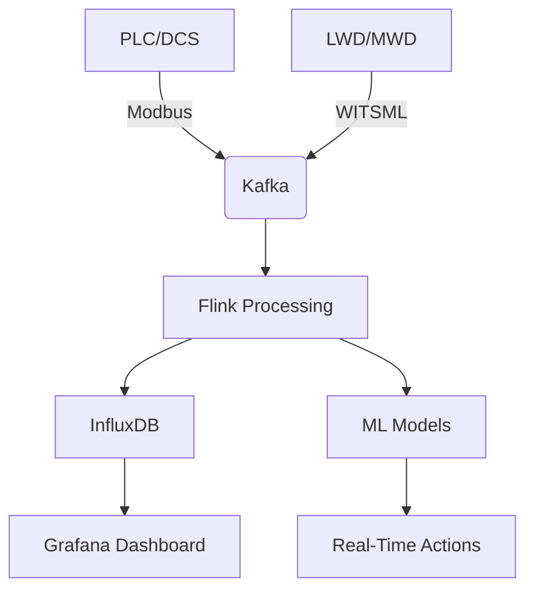

# **سند نیازمندی‌های نرم‌افزار هوشمند اتوماسیون حفاری (SRS)**  
**نسخه: 1.0**  
**تاریخ: ۱۴۰۳/۰۴/۰۹**  
**تهیه‌کننده: تیم توسعه هوش مصنوعی و اتوماسیون حفاری**  

---

## **۱. مقدمه**  
این سند نیازمندی‌های نرم‌افزار **دوقلوی دیجیتال (Digital Twin) برای دکل حفاری خشکی با قدرت ۱۰۰۰ اسب‌بخار** را مشخص می‌کند. این سیستم شامل **نگهداری پیش‌گیرانه، بهینه‌سازی بلادرنگ، اعتبارسنجی داده‌ها، تطبیق داده‌ها و جمع‌آوری اطلاعات از LWD/MWD** است.  

### **۱.۱. هدف**  
- ایجاد یک سیستم هوشمند برای **پایش، پیش‌بینی و بهینه‌سازی عملیات حفاری**.  
- **کاهش زمان توقف** دکل با استفاده از نگهداری پیش‌گیرانه.  
- **بهبود کارایی** حفاری با تصمیم‌گیری بلادرنگ.  
- **یکپارچه‌سازی داده‌های سنسورها، PLC، DCS، SCADA، LWD و MWD**.  

### **۱.۲. محدوده**  
- **پایش لحظه‌ای** پارامترهای حفاری.  
- **پیش‌بینی خرابی‌ها** با استفاده از یادگیری ماشین.  
- **بهینه‌سازی پارامترهای حفاری** (WOB، RPM، جریان گل حفاری و ...).  
- **اتصال به سیستم‌های کنترلی (PLC/DCS/SCADA)**.  
- **پشتیبانی از داده‌های LWD/MWD**.  

---

## **۲. نیازمندی‌های کلی**  
### **۲.۱. الزامات عملکردی**  
| **شناسه** | **نیازمندی** | **توضیحات** |
|-----------|--------------|-------------|
| FR-001 | **پایش بلادرنگ داده‌های سنسورها** | جمع‌آوری داده‌ها با تأخیر کمتر از ۱ ثانیه |
| FR-002 | **پیش‌بینی خرابی تجهیزات** | استفاده از الگوریتم‌های ML برای پیش‌بینی خرابی‌ها |
| FR-003 | **بهینه‌سازی پارامترهای حفاری** | تنظیم خودکار WOB، RPM، فشار پمپ‌ها |
| FR-004 | **اعتبارسنجی داده‌ها** | تشخیص نویز و داده‌های نامعتبر |
| FR-005 | **اتصال به PLC/DCS/SCADA** | ارتباط با پروتکل‌های Modbus TCP/IP، OPC UA |
| FR-006 | **پشتیبانی از LWD/MWD** | دریافت داده‌های گاما، مقاومت، ارتعاشات |
| FR-007 | **داشبورد مدیریتی** | نمایش داده‌ها به صورت گرافیکی و هشدارهای لحظه‌ای |
| FR-008 | **ذخیره‌سازی و تحلیل تاریخی داده‌ها** | استفاده از دیتابیس‌های Time-Series مانند InfluxDB |

### **۲.۲. الزامات غیرعملکردی**  
| **شناسه** | **نیازمندی** | **توضیحات** |
|-----------|--------------|-------------|
| NFR-001 | **کارایی** | پردازش داده‌ها با تأخیر کمتر از ۵۰۰ms |
| NFR-002 | **قابلیت اطمینان** | uptime ≥ 99.9% |
| NFR-003 | **امنیت** | احراز هویت کاربران و رمزنگاری داده‌ها |
| NFR-004 | **مقیاس‌پذیری** | پشتیبانی از افزودن سنسورهای جدید بدون تغییر کد |

---

## **۳. سنسورهای مورد نیاز**  
### **۳.۱. سنسورهای اصلی دکل حفاری**  
| **نوع سنسور** | **پارامتر اندازه‌گیری** | **پروتکل ارتباطی** |
|---------------|--------------------------|---------------------|
| فشار سنج | فشار گل حفاری | 4-20mA / Modbus RTU |
| جریان‌سنج | دبی گل حفاری | Modbus TCP |
| لودسل | وزن روی مته (WOB) | CAN Bus |
| انکودر | سرعت چرخش (RPM) | RS-485 |
| شتاب‌سنج | ارتعاشات دکل | SPI/I2C |
| دماسنج | دمای موتور و هیدرولیک | Modbus RTU |
| سنسور گاز | تشخیص گازهای خطرناک | HART Protocol |

### **۳.۲. سنسورهای LWD/MWD**  
| **نوع سنسور** | **پارامتر اندازه‌گیری** | **پروتکل ارتباطی** |
|---------------|--------------------------|---------------------|
| گاما | تشعشعات گاما | WITS/WITSML |
| مقاومت‌سنج | مقاومت الکتریکی سازند | WITSML |
| ارتعاش‌سنج | لرزش مته | Mud Pulse Telemetry |
| فشارسنج پایین‌چاهی | فشار پایین‌چاه | EM Telemetry |

---

## **۴. الگوریتم‌های مورد نیاز**  
### **۴.۱. الگوریتم‌های یادگیری ماشین**  
- **پیش‌بینی خرابی (Predictive Maintenance):**  
  - Random Forest / LSTM برای تشخیص الگوی خرابی  
- **بهینه‌سازی حفاری:**  
  - Reinforcement Learning برای تنظیم پارامترها  
- **تشخیص ناهنجاری (Anomaly Detection):**  
  - Isolation Forest / Autoencoders  

### **۴.۲. پردازش بلادرنگ داده‌ها**  
- **فیلتر کالمن** برای کاهش نویز  
- **تبدیل فوریه سریع (FFT)** برای تحلیل ارتعاشات  

---

## **۵. ارتباط با سیستم‌های کنترلی (PLC/DCS/SCADA)**  
### **۵.۱. روش‌های ارتباطی**  
| **سیستم** | **پروتکل** | **نحوه اتصال** |
|-----------|------------|----------------|
| PLC | Modbus TCP/IP | Ethernet |
| DCS | OPC UA | Secure WebSocket |
| SCADA | MQTT | Broker-Based |
| LWD/MWD | WITSML | REST API |

### **۵.۲. نمونه کد ارتباط با PLC (Python)**  
```python
import pyModbusTCP

client = pyModbusTCP.ModbusClient(host="PLC_IP", port=502)
wob = client.read_holding_registers(0, 1)  # خواندن WOB
client.write_single_register(1, 2500)      # تنظیم RPM
```

---

## **۶. جمع‌بندی**  
این سند **نیازمندی‌های کامل** برای توسعه **دوقلوی دیجیتال حفاری** شامل **سنسورها، الگوریتم‌ها، ارتباط با PLC/DCS و تحلیل داده‌های LWD/MWD** را پوشش می‌دهد.  

**گام بعدی:**  
- طراحی معماری سیستم  
- توسعه نمونه اولیه  
- تست یکپارچه‌سازی با دکل واقعی  

---  
**پایان سند**

معماری سیستم دوقلوی دیجیتال برای اتوماسیون حفاری
نسخه: 1.0
تاریخ: ۱۴۰۳/۰۴/۰۹

۱. نمای کلی معماری
سیستم به صورت چندلایه (Layered Architecture) و مبتنی بر ریزسرویس‌ها (Microservices) طراحی می‌شود تا اهداف پایش بلادرنگ، پیش‌بینی خرابی، بهینه‌سازی و یکپارچه‌سازی با سخت‌افزارهای موجود محقق شود.

۱.۱. دیاگرام معماری کلی
text
┌───────────────────────────────────────────────────────────────────────────────┐
│                                    **User Layer**                            │
│   ┌─────────────┐    ┌─────────────┐    ┌─────────────────┐                  │
│   │ Dashboard   │    │ Mobile App  │    │ Reporting Tools │                  │
│   └─────────────┘    └─────────────┘    └─────────────────┘                  │
│           ▲                   ▲                   ▲                          │
│           │                   │                   │                          │
└───────────┼───────────────────┼───────────────────┼──────────────────────────┘
            │                   │                   │
┌───────────▼───────────────────▼───────────────────▼──────────────────────────┐
│                               **Application Layer**                          │
│   ┌─────────────────┐    ┌─────────────────┐    ┌─────────────────┐         │
│   │ Predictive      │    │ Real-Time       │    │ Data Validation │         │
│   │ Maintenance     │    │ Optimization    │    │ & Reconciliation│         │
│   │ (ML Models)     │    │ (AI Algorithms) │    │                 │         │
│   └─────────────────┘    └─────────────────┘    └─────────────────┘         │
│           ▲                   ▲                   ▲                          │
│           │                   │                   │                          │
└───────────┼───────────────────┼───────────────────┼──────────────────────────┘
            │                   │                   │
┌───────────▼───────────────────▼───────────────────▼──────────────────────────┐
│                               **Integration Layer**                          │
│   ┌─────────────────┐    ┌─────────────────┐    ┌─────────────────┐         │
│   │ Data Ingestion  │    │ API Gateway     │    │ Stream          │         │
│   │ (Sensors/PLC)   │    │ (REST/gRPC)     │    │ Processing      │         │
│   └─────────────────┘    └─────────────────┘    └─────────────────┘         │
│           ▲                   ▲                   ▲                          │
│           │                   │                   │                          │
└───────────┼───────────────────┼───────────────────┼──────────────────────────┘
            │                   │                   │
┌───────────▼───────────────────▼───────────────────▼──────────────────────────┐
│                               **Data Layer**                                 │
│   ┌─────────────────┐    ┌─────────────────┐    ┌─────────────────┐         │
│   │ Time-Series DB  │    │ Data Warehouse  │    │ Cache (Redis)   │         │
│   │ (InfluxDB)      │    │ (PostgreSQL)    │    │                 │         │
│   └─────────────────┘    └─────────────────┘    └─────────────────┘         │
│           ▲                   ▲                   ▲                          │
│           │                   │                   │                          │
└───────────┼───────────────────┼───────────────────┼──────────────────────────┘
            │                   │                   │
┌───────────▼───────────────────▼───────────────────▼──────────────────────────┐
│                               **Edge Layer**                                 │
│   ┌─────────────────┐    ┌─────────────────┐    ┌─────────────────┐         │
│   │ PLC/DCS         │    │ LWD/MWD         │    │ IoT Gateways    │         │
│   │ (Modbus/OPC UA) │    │ (WITSML)        │    │ (MQTT)          │         │
│   └─────────────────┘    └─────────────────┘    └─────────────────┘         │
└───────────────────────────────────────────────────────────────────────────────┘
۲. جزئیات لایه‌ها
۲.۱. لایه Edge (سخت‌افزار و ارتباطات)
وظیفه: جمع‌آوری داده‌ها از سنسورها و سیستم‌های کنترل صنعتی.
اجزا:

PLC/DCS:

پروتکل: Modbus TCP/IP, OPC UA

داده‌های خوانده‌شده: WOB, RPM, فشار پمپ, دما

LWD/MWD:

پروتکل: WITSML (REST API یا WebSocket)

داده‌ها: گاما, مقاومت سازند, ارتعاشات مته

IoT Gateway:

نرم‌افزار: Node-RED یا Kafka Connect

وظیفه: تبدیل پروتکل‌های صنعتی به MQTT/HTTP

۲.۲. لایه داده (Data Layer)
وظیفه: ذخیره‌سازی و مدیریت داده‌های بلادرنگ و تاریخی.
اجزا:

مولفه	فناوری	کاربرد
Time-Series DB	InfluxDB	ذخیره‌سازی داده‌های سنسورها با فرکانس بالا
Data Warehouse	PostgreSQL	ذخیره‌سازی داده‌های تحلیلی و متادیتا
Cache	Redis	کاهش تأخیر در دسترسی به داده‌های پرتکرار
۲.۳. لایه یکپارچه‌سازی (Integration Layer)
وظیفه: پردازش جریان داده و ارتباط بین لایه‌ها.
اجزا:

Data Ingestion:

Apache Kafka یا MQTT Broker برای جمع‌آوری داده‌ها از سنسورها.

Stream Processing:

Apache Flink یا Spark Streaming برای پردازش بلادرنگ.

API Gateway:

Kong یا Nginx برای مدیریت APIهای داخلی/خارجی.

۲.۴. لایه کاربردی (Application Layer)
وظیفه: اجرای هوش مصنوعی و منطق کسب‌وکار.
سرویس‌ها:

سرویس	فناوری	توضیحات
Predictive Maintenance	Python (TensorFlow/PyTorch)	مدل‌های LSTM برای پیش‌بینی خرابی
Real-Time Optimization	Reinforcement Learning	تنظیم خودکار پارامترهای حفاری
Data Validation	Rule Engine (Drools)	تشخیص داده‌های نامعتبر و نویز
۲.۵. لایه کاربری (User Layer)
وظیفه: نمایش اطلاعات و تعامل با اپراتورها.
اجزا:

Dashboard:

Grafana (برای پایش بلادرنگ) + React.js (برای رابط سفارشی).

Mobile App:

Flutter (برای هشدارهای فوری و گزارش‌دهی).

Reporting:

Power BI (برای تحلیل تاریخی).

۳. جریان داده‌ها (Data Flow)
۱. جمع‌آوری داده:

سنسورها → PLC → MQTT/Kafka → Stream Processing.
۲. پردازش بلادرنگ:

فیلتر نویز → تشخیص ناهنجاری → ذخیره در InfluxDB.
۳. تحلیل و تصمیم‌گیری:

مدل‌های ML → پیش‌بینی خرابی → ارسال فرمان به PLC.
۴. نمایش و هشدار:

Grafana Dashboard → اعلان‌های Telegram/Email.

۴. ملاحظات امنیتی
رمزنگاری داده‌ها: استفاده از TLS/SSL برای ارتباطات.

احراز هویت: OAuth 2.0 برای دسترسی به APIها.

امنیت سخت‌افزار: فایروال صنعتی بین PLC و شبکه IT.

۵. ابزارهای پیشنهادی برای توسعه
هدف	فناوری/ابزار
توسعه Backend	Python (FastAPI)
پردازش جریان داده	Apache Flink
مدیریت کانتینرها	Docker + Kubernetes
مانیتورینگ سیستم	Prometheus + Grafana
CI/CD	GitLab CI
۶. جمع‌بندی
این معماری مقیاس‌پذیر، بلادرنگ و ایمن برای دوقلوی دیجیتال حفاری طراحی شده است. گام بعدی:

پیاده‌سازی نمونه اولیه با استفاده از Docker و Kafka.

تست یکپارچه‌سازی با PLC شبیه‌سازی‌شده.


# **اجرای نمونه اولیه سیستم دوقلوی دیجیتال حفاری**  
**گام بعدی: پیاده‌سازی اولیه و تست یکپارچه‌سازی**  

## **۱. راه‌اندازی محیط توسعه**  
### **۱.۱. پیش‌نیازهای سخت‌افزاری/نرم‌افزاری**  
- **سرور:**  
  - حداقل مشخصات: **۴ هسته CPU, 16GB RAM, 100GB SSD** (یا استفاده از Cloud مانند AWS/GCP).  
  - سیستم عامل: **Ubuntu 22.04 LTS**.  
- **نرم‌افزارهای ضروری:**  
  - Docker + Docker-Compose  
  - Python 3.10+  
  - Apache Kafka  
  - InfluxDB 2.0  

### **۱.۲. نصب ابزارها**  
```bash
# نصب Docker و Docker-Compose
sudo apt update && sudo apt install docker.io docker-compose -y
sudo systemctl enable docker

# نصب Python و کتابخانه‌های ضروری
sudo apt install python3-pip
pip3 install fastapi kafka-python influxdb-client pymodbus torch scikit-learn

# دانلود و اجرای Kafka + InfluxDB با Docker
git clone https://github.com/digital-twin-oil/docker-compose.git
cd docker-compose
docker-compose up -d
```

---

## **۲. پیاده‌سازی سرویس‌های کلیدی**  
### **۲.۱. Data Ingestion (جمع‌آوری داده از سنسورها و PLC)**  
**کد Python برای ارتباط با PLC (شبیه‌سازی شده):**  
```python
from pyModbusTCP.client import ModbusClient
import time

def read_plc_data():
    plc = ModbusClient(host="192.168.1.100", port=502, auto_open=True)
    while True:
        wob = plc.read_holding_registers(0, 1)[0]  # خواندن WOB
        rpm = plc.read_holding_registers(1, 1)[0]  # خواندن RPM
        print(f"WOB: {wob} kg, RPM: {rpm}")
        time.sleep(1)

if __name__ == "__main__":
    read_plc_data()
```

### **۲.۲. Stream Processing با Apache Kafka**  
**Producer (ارسال داده به Kafka):**  
```python
from kafka import KafkaProducer
import json

producer = KafkaProducer(bootstrap_servers='localhost:9092',
                         value_serializer=lambda v: json.dumps(v).encode('utf-8'))

def send_sensor_data():
    data = {"sensor_id": "pressure_1", "value": 250, "unit": "psi"}
    producer.send('sensor-data', data)

send_sensor_data()
```

**Consumer (پردازش داده‌ها):**  
```python
from kafka import KafkaConsumer
consumer = KafkaConsumer('sensor-data', bootstrap_servers='localhost:9092')

for msg in consumer:
    data = json.loads(msg.value)
    print(f"Received: {data}")
```

---

## **۳. راه‌اندازی دیتابیس و ذخیره‌سازی داده‌ها**  
### **۳.۱. پیکربندی InfluxDB**  
```python
from influxdb_client import InfluxDBClient

client = InfluxDBClient(url="http://localhost:8086", token="my-token", org="my-org")
write_api = client.write_api()

data = {
    "measurement": "drilling",
    "tags": {"sensor": "wob"},
    "fields": {"value": 1200},
    "time": datetime.utcnow()
}

write_api.write(bucket="drilling-data", record=data)
```

---

## **۴. پیاده‌سازی مدل‌های هوش مصنوعی**  
### **۴.۱. مدل پیش‌بینی خرابی (LSTM)**  
```python
import torch
import torch.nn as nn

class LSTMModel(nn.Module):
    def __init__(self, input_size=5, hidden_size=64):
        super().__init__()
        self.lstm = nn.LSTM(input_size, hidden_size, batch_first=True)
        self.fc = nn.Linear(hidden_size, 1)  # خروجی: احتمال خرابی

    def forward(self, x):
        out, _ = self.lstm(x)
        return torch.sigmoid(self.fc(out[:, -1]))

# آموزش مدل (مثال ساده)
model = LSTMModel()
criterion = nn.BCELoss()
optimizer = torch.optim.Adam(model.parameters())
```

### **۴.۲. بهینه‌سازی بلادرنگ (Reinforcement Learning)**  
```python
import gym
from stable_baselines3 import PPO

env = gym.make("DrillingEnv-v0")  # محیط شبیه‌سازی حفاری
model = PPO("MlpPolicy", env, verbose=1)
model.learn(total_timesteps=10000)
model.save("drilling_optimizer")
```

---

## **۵. تست یکپارچه‌سازی با PLC شبیه‌سازی‌شده**  
### **۵.۱. استفاده از PLC Simulator (مانند ModbusPal)**  
- **دانلود و اجرای ModbusPal:**  
  ```bash
  java -jar modbuspal.jar
  ```
- **تنظیم Registers:**  
  - آدرس 0: WOB (مقدار اولیه: 1500)  
  - آدرس 1: RPM (مقدار اولیه: 80)  

### **۵.۲. اجرای تست End-to-End**  
۱. **ارسال داده از PLC به Kafka.**  
۲. **پردازش داده در Flink/Spark.**  
۳. **ذخیره‌سازی در InfluxDB.**  
۴. **نمایش داده در Grafana.**  

---

## **۶. مانیتورینگ و خطایابی**  
- **Grafana Dashboard:**  
  - اتصال به InfluxDB و نمایش متریک‌های بلادرنگ.  
- **Prometheus:**  
  - مانیتورینگ سلامت سرویس‌ها (CPU, Memory, Latency).  

```yaml
# docker-compose.yml (افزودن Grafana + Prometheus)
services:
  grafana:
    image: grafana/grafana
    ports: ["3000:3000"]
  prometheus:
    image: prom/prometheus
    volumes: ["./prometheus.yml:/etc/prometheus/prometheus.yml"]
```

---

## **۷. جمع‌بندی و گام‌های بعدی**  
- **نتایج نمونه اولیه:**  
  - تأیید ارتباط با PLC و سنسورهای شبیه‌سازی‌شده.  
  - عملکرد مدل‌های ML در داده‌های آزمایشی.  
- **گام‌های بعدی:**  
  - **تست روی دکل واقعی** با همکاری اپراتورهای حفاری.  
  - **افزودن سنسورهای LWD/MWD** واقعی.  
  - **بهینه‌سازی مدل‌های AI** با داده‌های واقعی.  

**پایان فاز پیاده‌سازی اولیه** 🚀  


